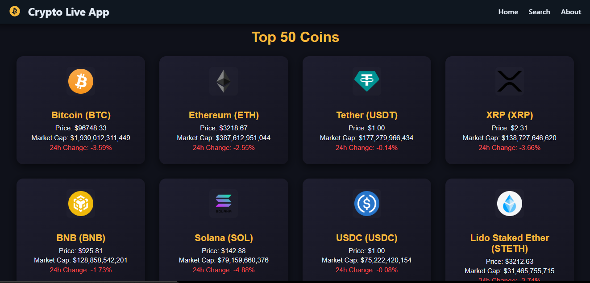

# 🚀 Crypto Live App


A modern and responsive **Crypto Live App** built with **React**, **TanStack Query**, and **CoinPaprika API** to track live cryptocurrency prices, market caps, and top coins.  
Fully dark-themed UI with interactive features, search functionality, and real-time updates.

---

## 🌟 Features

- Track **Top 50 cryptocurrencies** with live updates every 5 seconds
- Search for **any coin** by symbol or name
- View detailed information for a selected coin (price, market cap, 24h change, volume)
- Modern **dark UI theme** with responsive design
- Smooth **animations** using Framer Motion
- Typing effect for hero section

---

## 🛠 Tech Stack & Versions

- **Node.js:** v20.x (recommended)
- **React:** 19.x
- **TanStack Query (React Query):** ^5.x
- **Axios:** ^1.4.0
- **React Router DOM:** ^6.x
- **Framer Motion:** ^10.x
- **React Icons:** ^4.x
- **CSS Modules / Custom Dark Theme**

---

## ⚙️ Prerequisites

Make sure you have **Node.js** and **npm** or **yarn** installed:

```bash
node -v
npm -v
# or
yarn -v

📦 Installation

Clone the repository:
git clone https://github.com/<your-username>/crypto-live-app.git

Navigate to the project folder:
cd crypto-live-app

Install dependencies:
npm install
# or
yarn install

Start the development server:
npm start
# or
yarn start

Open the app in your browser:

http://localhost:5173


## 📸 Screenshots

### Home Page



### Search Page


### About Page


👨‍💻 Author

Azlan Shah 

Reach out via email: codewithazlo@gmail.com